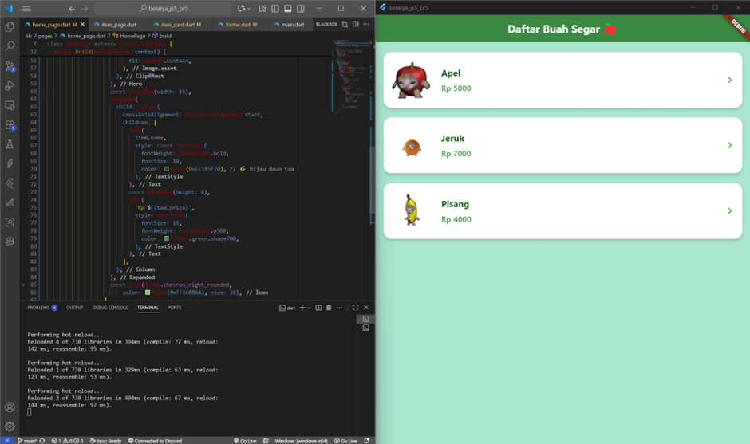
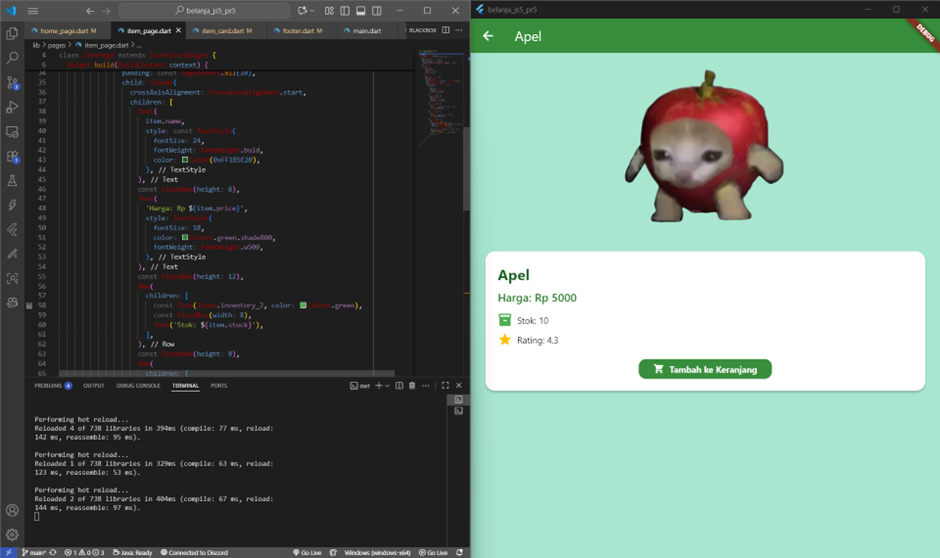
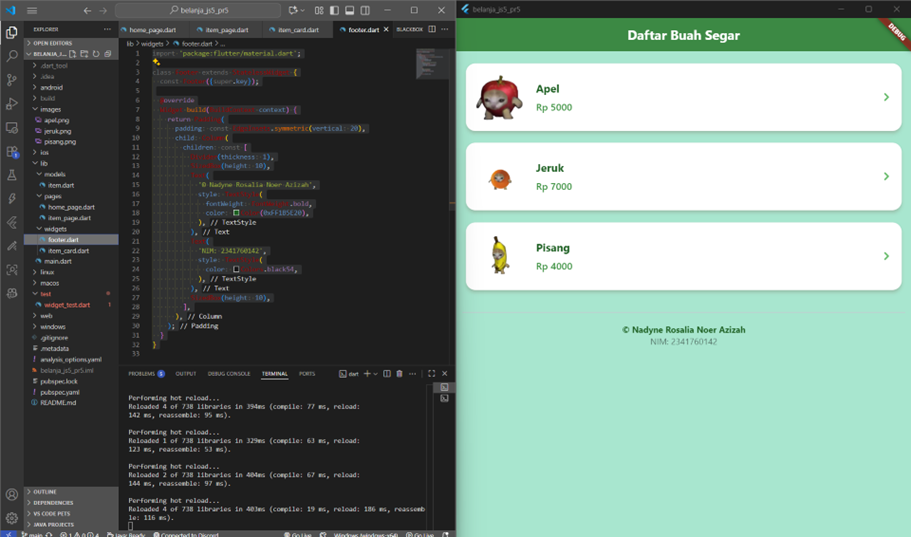
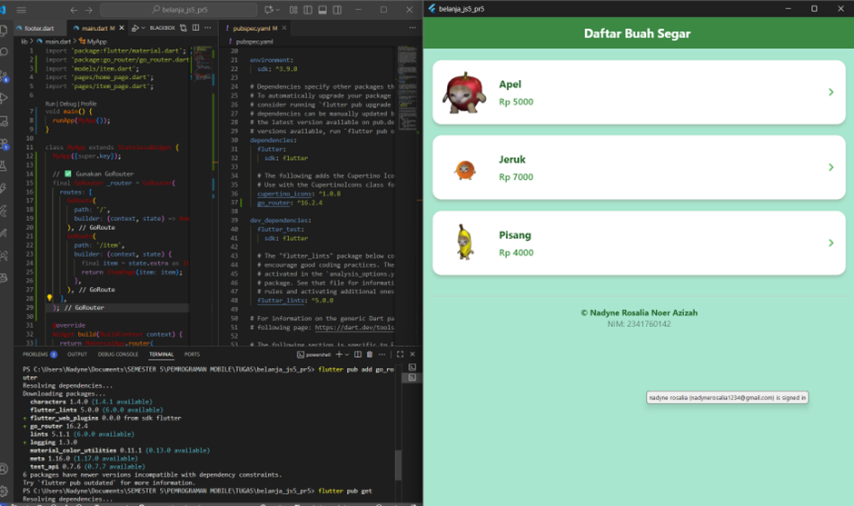

# belanja_js5_pr5

# Laporan Praktikum Flutter 2_Praktikum 5 dan Tugas 2
**Nama:** Nadyne Rosalia Noer Azizah  
**NIM:** 2341760142  
**Kelas:** SIB-3F   
**Mata Kuliah:** Pemrograman Mobile  
**Dosen Pengampu:** Ade Ismail S.Kom., M.TI  
**Prodi:** D-IV Sistem Informasi Bisnis 

## Praktikum 5: Navigasi dan Modularisasi Aplikasi Belanja Flutter

**Note:**
Pada praktikum ini dibuat aplikasi Flutter sederhana bertema "Aplikasi Belanja Buah Segar" 🍏 dengan konsep navigasi antar halaman dan modularisasi kode.

**Aplikasi terdiri dari:**

1. Halaman utama (HomePage) menampilkan daftar buah dalam bentuk list vertikal.
2. Halaman detail (ItemPage) menampilkan gambar besar, harga, stok, dan rating buah yang dipilih.
3. Navigasi antar halaman dilakukan menggunakan go_router.
4. Widget dipecah menjadi bagian kecil seperti:
    a. ItemCard → menampilkan tampilan kartu buah.
    b. Footer → menampilkan identitas pengembang (Nama & NIM).

- Selain itu, desain aplikasi dimodifikasi dengan tema warna hijau segar untuk menampilkan nuansa marketplace modern.

- tampilan halaman awal.

- tampilan halaman kedua setelah di klik.

# Tugas praktikum 2

**Point No 5**

Sesuaikan dan modifikasi tampilan sehingga menjadi aplikasi yang menarik. Selain itu, pecah widget menjadi kode yang lebih kecil. Tambahkan Nama dan NIM di footer aplikasi belanja Anda.

**Point No 6**
Implementasi Navigasi dengan go_router

**Note:**
Pada tugas praktikum ini, dilakukan modifikasi navigasi aplikasi Flutter menggunakan plugin go_router untuk menggantikan sistem routing manual berbasis Navigator.pushNamed().
Dengan go_router, proses navigasi menjadi lebih declarative, mudah dibaca, dan mendukung pengiriman data antar halaman secara langsung melalui parameter extra.

